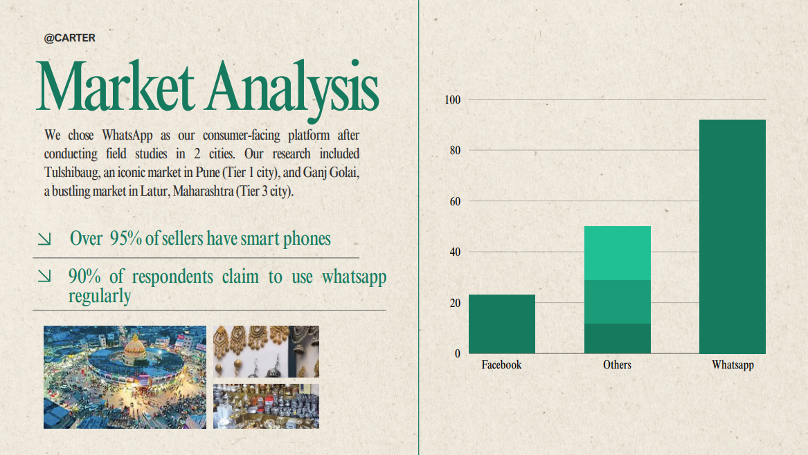

# What is our Approach?
- Why WhatsApp
- Onboarding Customer
- Creating Inventory
- Discovery Through Buyer app
- Going Forward

## What is Our Approach?
Our mission is simple: enable sellers to onboard the ONDC (Open Network for Digital Commerce) network and create digital inventories effortlessly, even for those who are not tech-savvy. We aim to remove barriers by leveraging cutting-edge AI and intuitive design.

### Key Elements of Our Approach:

#### User Interface:
We use WhatsApp as our primary interface, supported by natural language processing powered by large language models (LLMs). This ensures a familiar, user-friendly experience for sellers.

#### Self-Onboarding:
Sellers can onboard themselves by simply sending the required data to the bot. We handle the submission to the relevant authorities for approval—no middlemen, no associations.

#### AI-Driven Catalogue Creation:
Using an army of AI agents, we help sellers create their digital catalogues directly via WhatsApp. Sellers only need to upload product details and photos, and the agents do the rest.

#### Easily Discoverable Products:
By generating AI-driven product descriptions from user-provided photos and data, we create vector embeddings based on semantic meanings. This ensures products are highly discoverable across the ONDC network.

## Why WhatsApp?
We chose WhatsApp as our consumer-facing platform after conducting extensive field studies in markets across India. Our research included Tulshibaug, an iconic market in Pune (Tier 1 city), and Ganj Golai, a bustling market in Latur, Maharashtra (Tier 3 city).

### Field Study Insights:
- Smartphone Penetration: Over 95% of respondents had access to a smartphone
- Most Used App:
  - WhatsApp: 90%
  - Facebook: 10%
  - Others: 40% (e.g., Hotstar, gaming apps)
- WhatsApp Familiarity: Almost everyone knew how to use WhatsApp

### Why WhatsApp Works:
- Ubiquity: Almost everyone uses it, regardless of tech proficiency
- Ease of Use: Requires no additional learning for sellers
- Trust: Sellers trust WhatsApp to handle their data
- Multilingual Support: Sellers can type in any language, breaking language barriers
- Natural Language Understanding: By leveraging generative AI, we ensure seamless communication and avoid the frustrations of outdated chatbots
- Minimal Human Intervention: AI agents automate most tasks
- Low Cost: An affordable solution for sellers and the platform alike

## Onboarding Customers
We identified four major store types in traditional markets, such as Palika Bazaar:
1. Fashion Shops
2. Art and Craft Stores (including Accessories)
3. Kirana Stores (Packaged Food)
4. Sweet and Snack Shops (or Restaurants)

### Onboarding Steps:
Sellers are prompted to upload documents and provide legal information based on their store category.

#### General Requirements:
- Name
- Date of Birth (DOB)
- PAN Card
- GST Number
- Address
- Business Name
- Trade License
- Udyam Registration
- Bank Account Number and IFSC Code
- UPI ID
- Phone Number

#### Category-Specific Requirements:
- FSSAI license for food-related businesses

Once the seller provides the required details, the bot automatically submits them to the relevant authorities for approval, ensuring a seamless onboarding process.

## Creating Inventory

### AI Agent for Adding Inventory:
This AI agent is specifically designed to assist sellers in adding inventory by interacting conversationally. It guides the seller to provide crucial details like the product description, price, and quantity. The agent ensures accurate data entry by validating the seller's responses and self-correcting through recursive questioning when incorrect or irrelevant information is provided.

### Key Features:

#### Interactive Input Collection:
The agent asks the seller targeted questions, such as the name of the product, its price, and available quantity.

#### Input Validation:
- The agent checks whether the seller's response matches the required information (e.g., a number for price or quantity)
- If the seller provides unrelated or incorrect information, the agent explains the misunderstanding and reframes the question

#### Self-Correction and Guidance:
- The agent engages recursively, prompting the seller to correct their input when needed
- It simplifies the process by offering clear examples or explanations

#### Data Extraction for Inventory:
Once all required details are accurately collected, the agent compiles and stores the data for inventory purposes.

### Key Capabilities:
- Contextual Understanding: The agent identifies the type of information the user has provided based on their input
- Recursive Questioning: If the user provides an incorrect or irrelevant answer, the agent will reframe the question
- User-Friendly Interactions: The agent ensures the conversation remains intuitive
- Data Extraction: Once the required information is provided, the agent extracts and outputs it in the desired format

### Example Interaction:
Step-by-Step Process:
1. Initial Question: Agent: What is the price of the product?
2. User Response (Incorrect): User: It is called a red saree
3. Agent's Analysis: Recognizes that the input is a description, not the price
4. Agent's Response: Agent: It seems like you've provided the description of the product, but I need the price. Could you tell me how much it costs?
5. User Response (Corrected): User: Oh, it's for 500 rupees
6. Agent's Analysis: Identifies the correct price information in the response
7. Agent's Output: 500

### How It Works Internally:
- Input Parsing: The agent parses the user's input using natural language processing (NLP) techniques
- Entity Validation: It checks if the extracted entity matches the type of information requested
- Recursive Interaction: The agent repeats the process until it obtains the required data

## Agents for 4 Types of Stores

### 1. Art and Craft Description Generator
#### Purpose:
This agent evaluates handcrafted items and jewelry, focusing on their artistic, cultural, and functional aspects.

#### Parameters:
- Purpose: Decorative, functional, symbolic, or event-specific
- Material: Details on materials like metals, gemstones, wood, or ceramics
- Design Details: Patterns, engravings, textures, or motifs
- Craftsmanship: Skill, intricacy, and precision of creation
- Cultural/Artistic Inspiration: Historical or cultural influences
- Color Palette: Aesthetic contribution of colors and tones
- Wearability/Usability: Practicality and comfort
- Durability/Maintenance: Longevity and care
- Styling Potential: Versatility with decor or fashion
- Symbolism/Meaning: Emotional or cultural value

### 2. Packaged Food Description Generator
#### Purpose:
This agent evaluates packaged food products, focusing on their ingredients, flavor, nutritional value, and market appeal.

#### Parameters:
- Category/Purpose: Type of food and intended use
- Ingredients: Highlight organic, processed, or allergenic elements
- Flavor Profile: Key tastes like sweetness, tanginess, or umami
- Texture: How the texture enhances the eating experience
- Packaging Design: Practicality, aesthetics, and eco-friendliness
- Nutritional Value: Caloric and health benefits
- Shelf Life: Expiry and storage requirements
- Serving Suggestions: Ideas for consumption or pairing
- Market Appeal: Target audience and preferences
- Cultural/Trend Relevance: Culinary trends or cultural influences

### 3. Sweet and Snack Shop Description Generator
#### Purpose:
Specializing in Indian cuisine, this agent describes sweets and snacks, focusing on tradition, flavor, and presentation.

#### Parameters:
- Category/Occasion: Traditional, fusion, or festive items
- Ingredients: Focus on traditional and unique components
- Flavor Profile: Signature tastes like cardamom, jaggery, or spices
- Texture: Enhance the sensory experience
- Aroma: Distinct scents from ghee, spices, or essences
- Packaging/Presentation: Traditional or modern wrapping
- Regional Origin/Significance: Cultural and historical roots
- Nutritional Value: Balance of energy, protein, or fats
- Pairing Suggestions: Accompaniments like tea, chutneys, or coffee
- Cultural Relevance/Trends: Connections to traditions or modern trends

### 4. Fashion Description Generator
#### Purpose:
This agent specializes in shoes, sneakers, and other accessories.

#### Parameters:
- Occasion: Where the accessory fits best (casual, formal, etc.)
- Material: Detailed material description for quality assurance
- Design: Aesthetic and functional design elements
- Fit/Comfort: Practicality and wearability
- Seasonality: Best-suited seasons or conditions
- Color: Detailed color descriptions and combinations
- Functionality: Usability features like grip, breathability, or adjustability
- Styling Versatility: Pairing options with different outfits
- Durability: Material longevity and resistance to wear
- Pop Culture Reference: Links to trends or cultural symbols

### Workflow for Description Creation:
1. Data Input: Each agent receives specific product data
2. Parameter Evaluation: The agent processes the input against its defined evaluation parameters
3. Description Generation: It crafts a comprehensive, well-structured description
4. Output: The agent ensures the description is engaging and accurate

## Discovery Through the Buyer App
The Indian market is as diverse as its people, making structured categorization inefficient and impractical for such a vast variety of products. To address this challenge, we have adopted an innovative approach to enhance product discovery through the buyer app.

### Our Solution: Semantic Search with Vector Embeddings

#### Description-Driven Approach:
Once a product is added, we generate a detailed AI-driven description using the data and images provided by the seller.

#### Vector Embeddings:
We create vector embeddings for each product description, capturing its semantic meaning rather than relying solely on keywords or rigid categories.

#### Cosine Similarity Search:
By leveraging cosine similarity, we enable semantic search, where the buyer can find products based on intent and context rather than exact words.

#### Adaptive Discovery:
This method allows us to overcome the inefficiencies of traditional categorization, ensuring that the diversity of products in the Indian market is fully represented and easily accessible.

## Going Forward
As we continue to enhance the platform, we envision the following developments in upcoming phases:

### 1. Voice-Enabled Billing for Digital Inventory
#### Goal: 
Simplify the billing process and simultaneously maintain an updated digital inventory.

#### How It Works:
- Store owners can use voice commands to generate bills directly
- The system will automatically generate the bill and update inventory in real-time

### 2. Multilingual Accessibility
#### Goal: 
Make the platform universally accessible across India's diverse linguistic landscape.

#### How It Works:
- Enable sellers to interact in their preferred language
- Use real-time translation and natural language processing

### 3. Fine-Tuning Our Own AI Models
#### Goal: 
Reduce reliance on external dependencies and make the platform more cost-effective.

#### How It Works:
- Utilize user-generated data to fine-tune our own AI models
- Build a robust system optimized for specific tasks
- Benefits include lower costs and better customization

### The Road Ahead
By focusing on voice-enabled tools, language accessibility, and AI independence, we aim to create a holistic, cost-efficient, and inclusive ecosystem that empowers sellers of all scales. These initiatives align with our commitment to digitizing India's markets while keeping them rooted in their unique diversity.

Follow these steps to set up and run the project locally:

### 1. Set Up a Facebook Developer App  
1. Create a developer account on [Facebook for Developers](https://developers.facebook.com/).  
2. Set up a new app and generate an access token.  
3. Note down the access token as it will be required later.  

### 2. Set Up Ngrok  
1. Create an account on [Ngrok](https://ngrok.com/).  
2. Download and set up Ngrok on your system.  
3. Generate an authenticated domain from Ngrok and note it down.  

### 3. Set Up the Project  
1. Clone this repository to your local machine:  
   git clone <repository_url>  
   cd <repository_folder>  
2. Set up a virtual environment:  
   python -m venv venv  
3. Activate the virtual environment:  
   - On Windows: venv\Scripts\activate  
   - On macOS/Linux: source venv/bin/activate  
4. Install the required dependencies:  
   pip install -r requirements.txt  

### 4. Configure Authentication Keys  
1. Create a .env file in the root of the project.  
2. Add the necessary authentication keys, including:  
   - The Facebook access token.  
   - Ngrok domain details.  
   - Any other environment variables required by the project.  

### 5. Start the Application  
1. Run the main script:  
   python main.py  
2. Start the Ngrok server, binding it to port 3000:  
   ngrok http 3000  

### 6. Update Facebook App Settings  
1. Go to your Facebook app dashboard.  
2. Update the callback URL to your Ngrok domain, appending the appropriate endpoint (e.g., https://your-ngrok-domain.com/callback).  

### 7. Test the Bot  
1. Send a message to your bot via Facebook Messenger.  
2. Verify that the bot responds as expected.